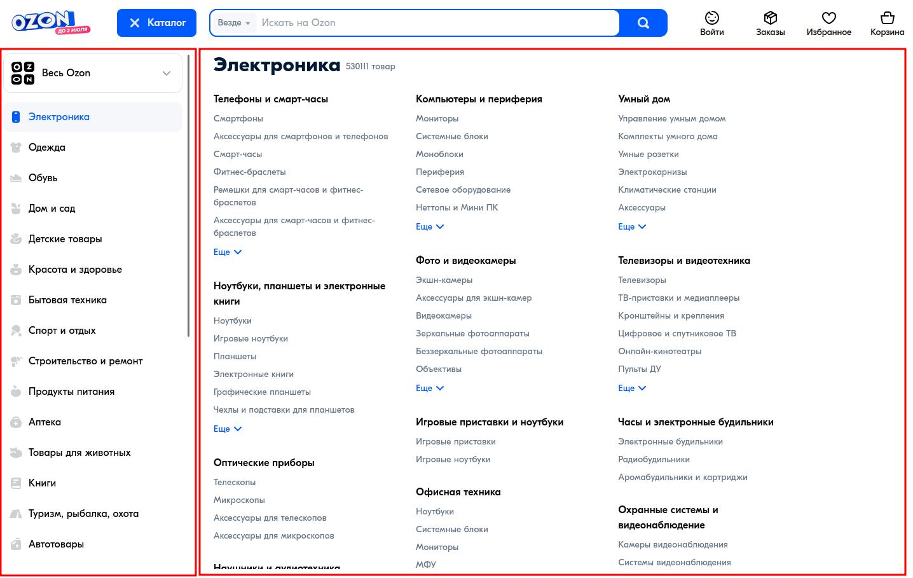
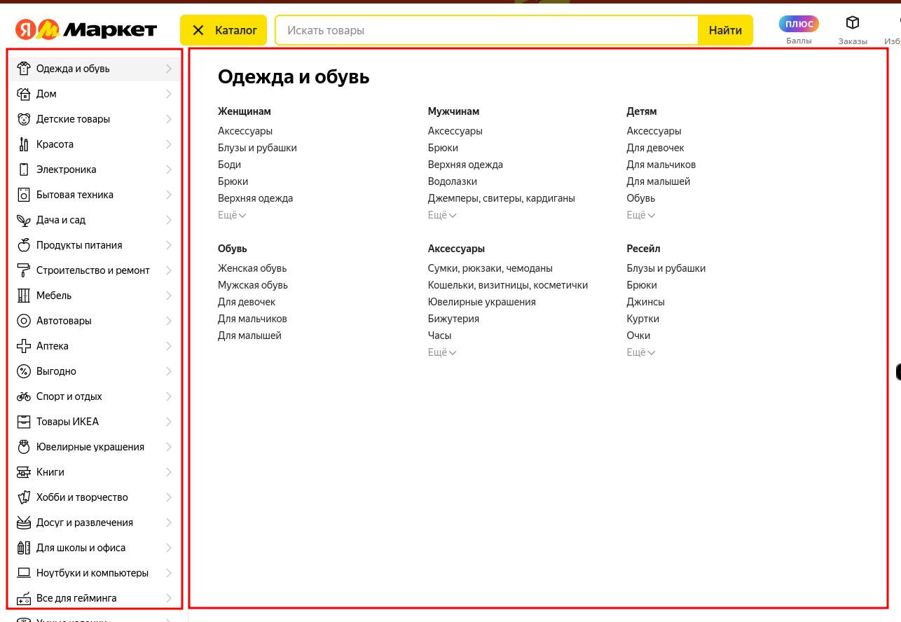

# DesktopMenu

DesktopMenu - представляет собой компонент большого меню для desktop версии.

Вес <Badge type="info">~ 2.14 kB gzipped.</Badge>

## Описание

DesktopMenu - Vue-компонент предназначен для отображения многоуровневого меню на десктопных устройствах. Он 
обеспечивает удобную навигацию с поддержкой раскрывающихся подменю, управляемых кликом или наведением, и позволяет 
кастомизировать отображение элементов меню.

### Функционал

Компонент написан для реализации десктопного меню. По умолчанию, компонент содержит структуру, которая идеально 
подходит для технической и визуальной реализации меню как на скриншотах ниже:

**Ozon**


**Yandex Market**


### Структура

- Первый уровень меню - рубрикатор, он содержит главные разделы сайта. На скриншотах рубрикатор находится в левой 
колонке и при клике/наведении мышки на него, в правой колонке открывается контекстуальные уровни меню.
- Второй и последующие уровни меню - содержат дерево ссылок, которые позволяют выводить неограниченную вложенность 
меню.

## Установка

<!--@include: ../../../shared/install.md-->

## Подключение

### Vue 3

```typescript
import DesktopMenu from '@iwyfaf-vue-ui/ariadna-ui/DesktopMenu';
```

### Nuxt 3

<!--@include: ../../../shared/import/nuxt-3.md-->

## Props

| Prop           | Required | Type                          | Default                                | Description                                                                                          |
|----------------|----------|-------------------------------|----------------------------------------|------------------------------------------------------------------------------------------------------|
| `data`         | ✓        | `Array<TSharedMenu>`          | `[]`                                   | Данные меню.                                                                                         |
| `expandMode`   | -        | `TDesktopMenuPropsExpandMode` | `EDesktopMenuPropsDefault.EXPAND_MODE` | Режим раскрытия контекстуального меню.                                                               |
| `visibleItems` | -        | `number`                      | `0`                                    | Количество видимых элементов для третьего уровня меню. Если значение 0, все элементы будут видимыми. |
| `overlay`      | -        | `boolean`                     | `true`                                 | Включает или выключет overlay элемент меню.                                                          |
| `invalid`      | -        | `boolean`                     | `false`                                | Невалидное состояние компонента.                                                                     |
| `cssClass`     | -        | `string`                      | `EDesktopMenuPropsDefault.CSS_CLASS`   | Переопределяет структуру CSS классов.                                                                |
| `modifier`     | -        | `TSharedPropsModifier`        | `undefined`                            | Модификатор базового CSS-класса.                                                                     |

### `data`

- **Тип:** `Array<TSharedMenu>`
- **Значение по умолчанию:** `[]`
- **Описание**: Данные меню.

::: details Пример
<demo src="./demos/demo.props.data.vue"></demo>
:::

### `expandMode`

- **Тип:** `TDesktopMenuPropsExpandMode`
- **Значение по умолчанию:** `EDesktopMenuPropsDefault.EXPAND_MODE`
- **Описание**: Режим раскрытия контекстуального меню.

::: details Пример
<demo src="./demos/demo.props.expand-mode.vue"></demo>
:::

### `visibleItems`

- **Тип:** `number`
- **Значение по умолчанию:** `0`
- **Описание**: Количество видимых элементов для третьего уровня меню. Если значение 0, все элементы будут видимыми.

::: details Пример
<demo src="./demos/demo.props.visible-items.vue"></demo>
:::

### `overlay`

- **Тип:** `boolean`
- **Значение по умолчанию:** `true`
- **Описание**: Включает или выключет overlay элемент меню.

::: details Пример
<demo src="./demos/demo.props.overlay.vue"></demo>
:::

### `invalid`

- **Тип:** `boolean`
- **Значение по умолчанию:** `false`
- **Описание**: Невалидное состояние компонента. Добавляет модификатор `--invalid`.

::: details Пример
<demo src="./demos/demo.props.invalid.vue"></demo>
:::

## Slots

| Slot         | Description                                                              |
|--------------|--------------------------------------------------------------------------|
| `rubricator` | Слот для элементов рубрикатора (первого уровня меню).                    |
| `menu`       | Слот для пунктов контекстного меню с расширенными элементами управления. |
| `loading`    | Слот для состояние загрузки.                                             |
| `error`      | Слот для состояние ошибки.                                               |

### `rubricator`

- **Описание:** Используется для отображения элементов рубрикатора (первого уровня меню).
- **Тип:** `(props: {
    data: Array<TSharedMenu>;
    secondLevelVisibleHandler: (uniqKey: TSharedMenu) => void;
    activeMenu: TSharedMenu | null;
  }) => VNode[]`

::: details Пример
<demo src="./demos/demo.slots.rubricator.vue"></demo>
::: 

### `menu`

- **Описание:** Используется для отображения пунктов контекстного меню с расширенными элементами управления.
- **Тип:** `(props: {
    data: TSharedMenu;
    mapShowMoreState: Map<Array<TSharedMenu> | undefined, boolean>;
    showMoreHandler: (uniqKey: Array<TSharedMenu>) => void;
    isMenuElementHidden: (idx: number, children: Array<TSharedMenu>) => boolean;
  }) => VNode[]`

::: details Пример
<demo src="./demos/demo.slots.menu.vue"></demo>
::: 

### `loading`

- **Описание:** Используется для отображения состояние загрузки.
- **Тип:** `() => VNode[]`

::: details Пример
<demo src="./demos/demo.slots.loading.vue"></demo>
::: 

### `error`

- **Описание:** Используется для отображения состояние ошибки.
- **Тип:** `() => VNode[]`

::: details Пример
<demo src="./demos/demo.slots.error.vue"></demo>
::: 

## Emits

| Event            | Payload | Description                                                         |
|------------------|---------|---------------------------------------------------------------------|
| `mounted`        | -       | Событие срабатывает при монтировании компонента.                    |
| `click:overlay`  | -       | Событие срабатывает когда пользователь нажимает на overlay элемент. |

### mounted

- **Описание:** Событие срабатывает при монтировании компонента.
- **Тип:** -

### click:overlay

- **Описание:** Событие срабатывает когда пользователь нажимает на overlay элемент.
- **Тип:** -

## Accessibility

<!--@include: ../../../shared/accessibility/no-roles.md-->

<!--@include: ../../../shared/accessibility/roles-can-inherit.md-->

### Поддержка клавиатуры

<!--@include: ../../../shared/accessibility/no-keyboard-support.md-->

## Стилизация

<!--@include: ../../../shared/styles/description.md-->

### Тема

- `--theme`: Задаются цветовые стили.

### Состояние

- `--loading`: Задаются для визуализации состояния отсутствия данных в компоненте.
- `--invalid`: Задаются для визуализации состояния ошибки.

::: details Пример расстановки стилей
```scss
$desktop-menu: '.ar-desktop-menu';

#{$desktop-menu} {
  // .ar-desktop-menu--theme
  &--theme {
    // .ar-desktop-menu--theme .ar-desktop-menu__wrapper
    #{$desktop-menu}__wrapper {}

    // .ar-desktop-menu--theme .ar-desktop-menu__rubricator
    #{$desktop-menu}__rubricator {
      // .ar-desktop-menu--theme .ar-desktop-menu__rubricator-item
      &-item {}
    }

    // .ar-desktop-menu--theme .ar-desktop-menu__menu
    #{$desktop-menu}__menu {
      // .ar-desktop-menu--theme .ar-desktop-menu__menu-items
      &-items {}
    }
  }

  // .ar-desktop-menu--invalid
  &--invalid {
    // .ar-desktop-menu--invalid.ar-desktop-menu--theme
    &#{$desktop-menu}--theme {
      // .ar-desktop-menu--invalid.ar-desktop-menu--theme .ar-desktop-menu__wrapper
      #{$desktop-menu}__wrapper {}
    }
  }

  // .ar-desktop-menu__wrapper
  &__wrapper {}

  // .ar-desktop-menu__container
  &__container {}

  // .ar-desktop-menu__rubricator
  &__rubricator {
    // .ar-desktop-menu__rubricator-item
    &-item {}
  }

  // .ar-desktop-menu__menu
  &__menu {
    // .ar-desktop-menu__menu-title
    &-title {}

    // .ar-desktop-menu__menu-wrapper
    &-wrapper {}

    // .ar-desktop-menu__menu-subtitle
    &-subtitle {}

    // .ar-desktop-menu__menu-items
    &-items {}
  }

  // .ar-desktop-menu__submenu
  &__submenu {
    // .ar-desktop-menu__submenu-item
    &-item {
      // .ar-desktop-menu__submenu-item--hidden
      &--hidden {}
    }
  }

  // .ar-desktop-menu__loading, .ar-desktop-menu__error
  &__loading,
  &__error {}
}
```
:::
